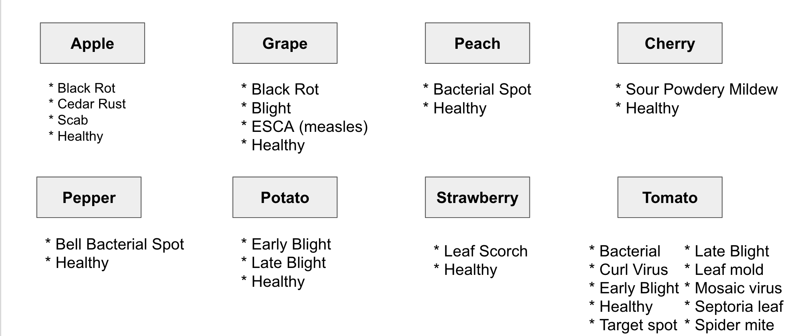
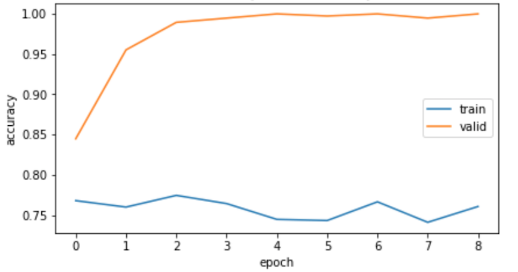

# Leaf-Disease-Classifier

* Leaf Disease Classifier classifies disease based on image processing techniques for automated vision system used at agricultural field. 

* The classifier is trained on the dataset found at
   * https://www.kaggle.com/emmarex/plantdisease
   * https://github.com/spMohanty/PlantVillage-Dataset
    

# Deep Dive into Concepts
- [Disease Classifier](##DiseaseClassifier)
- [How To Train](##HowToTrain)
- [Run Model](##RunModel)

## Disease Classifier

The whole disease classification process is divided into 2 stages as in 

- 8 CNN classifiers are trained to identify the diseases of each of the 8 plant classes.  The result from stage 2 is used to call the classifier that has been trained to classify the different diseases for that plant. If there are none, the leaf would be classified as 'Healthy'.

- All the above CNN's are trained on a Deep Residual Network- ResNet-50 Architecture using "Transfer Learning" from the ImageNet weights.

[//]: # ()

- Frameworks used : Keras

# How-To-Train:

## Run Model

- To run and setup the model, you’ll need at least OpenCV 3.4.2.
- 
